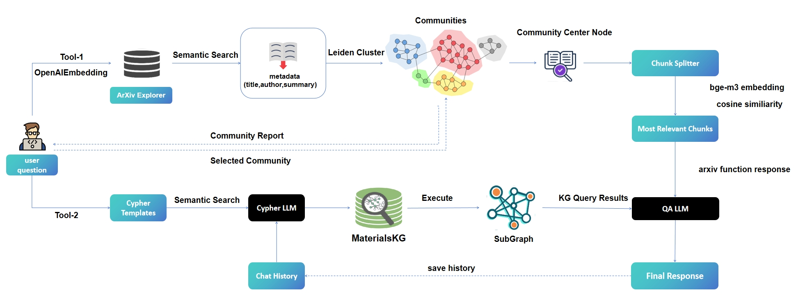
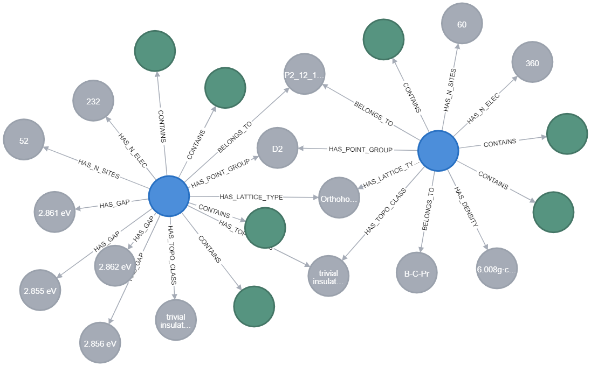
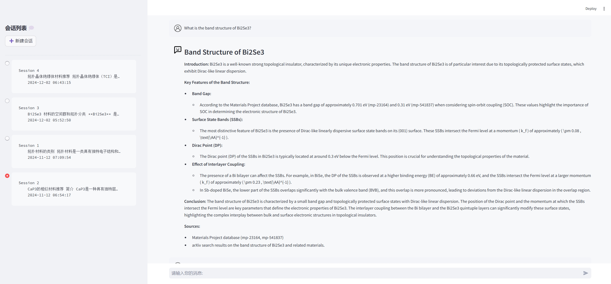

# TopoChat: A Knowledge Graph-Enhanced Chatbot for Materials Science

## Overview
TopoChat is an intelligent chatbot system specifically designed for materials science research, integrating knowledge graph capabilities with scientific literature analysis. It leverages a comprehensive materials science knowledge base and advanced natural language processing to provide expert-level responses to materials science queries.




## Architecture
The system is built on a hybrid architecture combining:
1. Knowledge Graph integration using langchain's neo4j-cypher-memory  
2. Literature analysis powered by ArXivExplorer and Leiden Cluster Algorithm
3. Intelligent query processing and response generation

### Materials Knowledge Graph (MaterialsKG)
- Built upon [Materiae](http://condmatt.iphy.ac.cn/) and [Materials Project](https://materialsproject.org/) databases
- Incorporates structural descriptions generated by Robocrystallographer 
- Current scale (until 2024/11/13):
  - 192,000+ nodes
  - 825,000+ relationships
- Detailed node and relationship schemas available in `materialskg_export.graphml`



### Literature Analysis System
- Implements ArXivExplorer for initial literature retrieval
- Uses Leiden clustering algorithm for community detection
- Automatically identifies central papers within user-selected research communities
- Provides contextualized responses based on relevant literature

### Response Generation
The system generates comprehensive responses by combining:
- Knowledge graph query results
- Relevant literature analysis 
- Expert-level synthesis of information

## Installation

### Prerequisites
- Python 3.10.14
- Neo4j Database(need apoc plugin)
- Additional dependencies 

### Setup
#### Step 1: Import Knowledge Graph Data
1. Import MaterialsKG data using APOC in Neo4j:
```cypher
CALL apoc.import.graphml("materialskg_export.graphml", {readLabels:true})
```
2. Import conversation history data:
```cypher
CALL apoc.import.graphml("history_export.graphml", {readLabels:true})
```
3. Configure Neo4j Database Connection (in chain.py):

```python
graph = Neo4jGraph(
    url=NEO4J_URI, username=NEO4J_USER, password=NEO4J_PASSWORD, database="neo4j"
)

history_graph = Neo4jGraph(
    url=NEO4J_URI, username=NEO4J_USER, password=NEO4J_PASSWORD, database="history"
)
```
4. Start Neo4j database service

#### Step 2: Launch Application
```bash
conda env create -f environment.yml

cd materialschat/matapp/packages/neo4j-cypher-memory

streamlit run app.py
```
Access the interface at: http://localhost:8501/



### Citation
If you use TopoChat in your research, please cite:

[Citation information to be added]

### Contact
hcxu@cnic.cn

zhangbh@sccas.cn